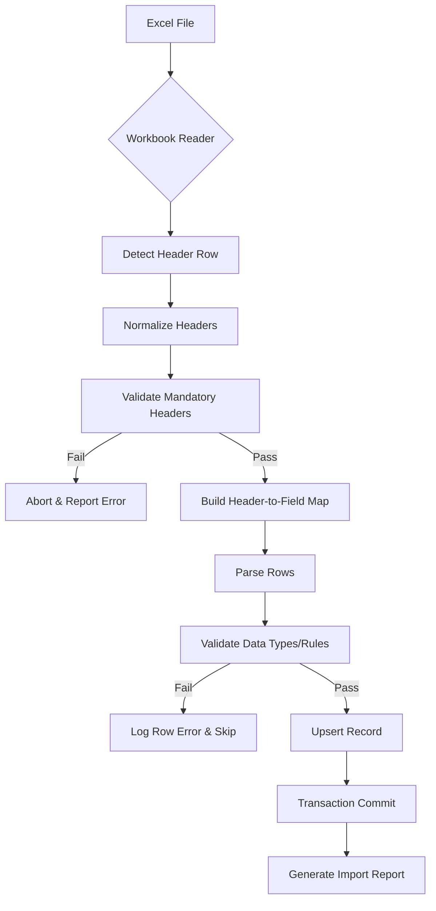

# ASSURANCE IMPORT ARCHITECTURE

## Pipeline Design (Fail-Safe)

The import process is designed to be atomic, auditable, and resilient to schema changes.

## Implementation Phases

### 1. Pre-Processing (Header Discovery)
- The importer opens the Excel file and reads the first row (header).
- Headers are normalized (lowercase, whitespace trimmed, typo-corrected per mapping rule).
- The system checks if all "Mandatory Headers" exist. If missing, it halts.
- A `header_map` is constructed: `detected_header_index -> canonical_field`.

### 2. Processing (Streaming / Batch)
- Rows are read sequentially to minimize memory overhead.
- Each row is transformed into a **Canonical Assurance Record** object using the `header_map`.
- Validation is performed on each record (type checks, length checks, business logic).
- Valid records are queued for the database operation (UPSERT).

### 3. Database Operation (Atomic Transaction)
- All operations within a single file import MUST be wrapped in a database transaction (`BEGIN` ... `COMMIT`).
- If ANY critical error occurs, the entire transaction is rolled back (`ROLLBACK`).

### 4. Import Reporting
- An object containing metadata about the import (success, warning, error lists) is generated and returned to the caller.
- This report is stored for auditing purposes.

## Future-Proofing (Schema Evolution)
- By relying on the `header_map`, we decouple the Excel structure from the database.
- Future Excel versions adding new fields will be automatically ignored (Phase 1, step 3).
- Future Excel versions removing optional fields will trigger a warning, but not a fatal error (Phase 1, step 2).
